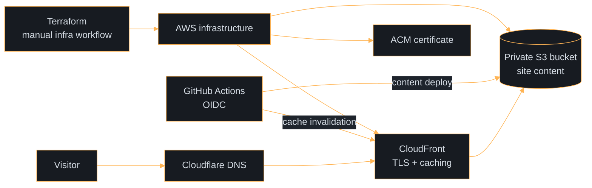

For a while, my resume site ran from a server in my homelab. It worked well enough, right up until the electricity decided to participate in the architecture.

When the power went out, the site was completely unreachable. Bringing it back meant manually turning things on and getting the homelab running again. Not a dramatic outage in the grand scheme of distributed systems, but a very clear single point of failure.

So I migrated the site to AWS.

The new setup is intentionally simple: static content lives in a private S3 bucket and is served through CloudFront. Cloudflare still handles DNS, while ACM provides TLS. Terraform manages the infrastructure, and GitHub Actions deploys content whenever changes reach `main`.

The deployment pipeline uses GitHub's OIDC integration instead of long-lived AWS access keys. Content deployment and infrastructure changes are separate workflows: publishing a blog post is automatic, while changing infrastructure requires an explicit Terraform run and review.

The traffic is modest, which is exactly why the architecture should stay modest too. This site is not hosting the Super Bowl halftime show. It is hosting a resume, so an always-on server, unnecessary DNS migration, and oversized platform would be difficult to justify.

That is where FinOps comes in. Public-cloud cost and good architecture are not opposites when the design is deliberate: no always-on server, lifecycle rules for old S3 versions, no unnecessary Route 53 hosted zone, and a budget alarm for early warning.

The result is a small, reproducible, secure deployment that no longer depends on whether my house has power.

A small project is still a production system if people depend on it. Reliability is often less about adding complexity than removing the right failure modes.